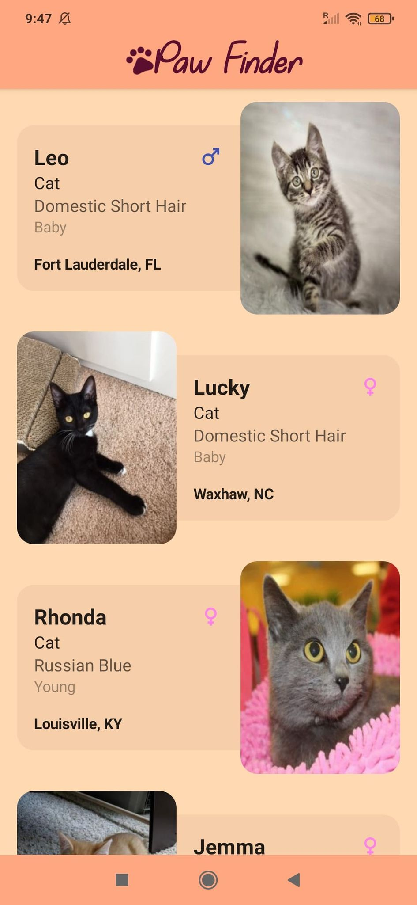

# Paw Finder 🐾


## :scroll: Description

An application showing pets to adopt from the [PetFinder](https://www.petfinder.com/developers/) API

## :bulb: Motivation and Context

Built initially as a submission for the Jetpack Compose Android dev challenge.

Developed a bit further to explore the stable release of Jetpack Compose along with some other
libraries.

## 🚧 Built with

|What|How|
|--------------------------|--------------------------------------------------------------------------------------------------------------------------------------------------------------------------------|
| 🐶 User Interface        |[Jetpack Compose](https://github.com/jetbrains/compose-jb)                                                                                                                      |
| 🏗 Architecture          |[MVVM](https://en.wikipedia.org/wiki/Model%E2%80%93view%E2%80%93viewmodel)                                                                                                      |
| 💉 DI                    |[Dagger2](https://github.com/google/dagger) + [Hilt](https://developer.android.com/training/dependency-injection/hilt-android)                                                  |
| 🚦 Navigation            |[Jetpack Navigation](https://developer.android.com/jetpack/compose/navigation)                                                                                                  |
| 💫 Navigation Animations |[Accompanist Navigation Animations](https://github.com/google/accompanist/tree/main/navigation-animation)                                                                       |
| 📐 Edge to Edge content  |[Accompanist Insets](https://github.com/google/accompanist/tree/main/insets)                                                                                                    |
| 🌊 Async                 |[Coroutines](https://kotlinlang.org/docs/coroutines-overview.html) + [Flow](https://kotlin.github.io/kotlinx.coroutines/kotlinx-coroutines-core/kotlinx.coroutines.flow/-flow/) |
| 🌐 Networking            |[Retrofit](https://github.com/square/retrofit)                                                                                                                                  |
| 🔢 Serialization         |[KotlinX Serialization](https://github.com/Kotlin/kotlinx.serialization)                                                                                                        |
| 💾 Storage               |[Room](https://developer.android.com/jetpack/androidx/releases/room)                                                                                                            |
| 🔑 Key-Value Storage     |[Jetpack Datastore](https://developer.android.com/topic/libraries/architecture/datastore)                                                                                       |
| 🏞 Image Loading         |[Coil](https://github.com/coil-kt/coil)                                                                                                                                         |

## :camera_flash: Screenshots

 


## License

```
Copyright 2020 The Android Open Source Project

Licensed under the Apache License, Version 2.0 (the "License");
you may not use this file except in compliance with the License.
You may obtain a copy of the License at

    https://www.apache.org/licenses/LICENSE-2.0

Unless required by applicable law or agreed to in writing, software
distributed under the License is distributed on an "AS IS" BASIS,
WITHOUT WARRANTIES OR CONDITIONS OF ANY KIND, either express or implied.
See the License for the specific language governing permissions and
limitations under the License.
```
